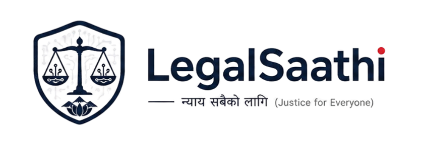

<div align="center">



# LegalSaathi — AI

### Nepal's First AI-Powered Legal Assistant

**Understand your legal rights in Nepali, Hindi, and English — instantly.**

[]
[]
[]

[](https://nextjs.org/)
[](https://nodejs.org/)
[](https://fastapi.tiangolo.com/)
[](https://www.mongodb.com/)
[](https://www.python.org/)
[](https://weaviate.io/)
[](https://vercel.com/)

</div>

---

## 🇳🇵 The Problem

> **73% of Nepali citizens cannot afford a lawyer.**
> Most don't know their basic legal rights.
> They upload scanned court notices, land papers, and labor contracts — and have no idea what they mean.

LegalSaathi bridges this gap — giving every Nepali citizen free access to legal knowledge in their own language, powered by AI trained on Nepal's actual legal corpus.

---

## ✨ Features

| Feature | Description |
|---------|-------------|
| 📄 **Document Analyzer** | Upload any legal document (PDF/image) → OCR extracts text → RAG pipeline → Plain Nepali/English summary + rights + next steps |
| ⚖️ **Legal Q&A Chat** | Ask any legal question in Nepali/Hindi/English → AI searches Nepal law corpus → Answers with exact law citations |
| 🔍 **Is This Legal?** | Describe any situation → Instant LEGAL/ILLEGAL/UNCLEAR verdict based on Nepal law |
| 🛡️ **Rights Navigator** | Explore your rights by category — Land, Labor, Criminal, Family, Consumer |
| 📋 **Document History** | All analyzed documents saved with summaries and timestamps |
| 🌐 **Multilingual** | Full support for Nepali (नेपाली), Hindi (हिन्दी), and English |
| 🔐 **Google OAuth** | Sign in with Google — secure, fast, no password needed |

---

## 🏗️ System Architecture

```
┌─────────────────────────────────────────────────────────┐
│                    LegalSaathi Platform                  │
├─────────────────┬───────────────────┬───────────────────┤
│   Next.js 16    │   Express.js      │    FastAPI        │
│   Frontend      │   API Gateway     │    AI Service     │
│   Vercel        │   Render          │    Render         │
└─────────────────┴───────────────────┴───────────────────┘
         │                  │                  │
         │                  ▼                  ▼
         │           ┌──────────┐      ┌──────────────┐
         │           │ MongoDB  │      │   Weaviate   │
         │           │  Atlas   │      │  Vector DB   │
         │           │ (Users + │      │ (Nepal Legal │
         │           │  Docs)   │      │   Corpus)    │
         │           └──────────┘      └──────────────┘
         │                                     │
         │                             ┌───────────────┐
         │                             │  Groq LLaMA   │
         │                             │  3.3 70B      │
         │                             │  (LLM Engine) │
         │                             └───────────────┘
         ▼
┌─────────────────┐
│   Cloudinary    │
│  (PDF + Image   │
│    Storage)     │
└─────────────────┘
```

### Request Flow — Document Analysis

```
User uploads PDF
      ↓
Cloudinary stores file
      ↓
Node.js backend calls AI service
      ↓
Tesseract OCR extracts text
      ↓
Weaviate semantic search finds relevant Nepal laws
      ↓
Groq LLaMA analyzes document + laws
      ↓
Returns: Summary + Rights + Next Steps + Law Citations
      ↓
Saved to MongoDB for history
```

---

## 🛠️ Tech Stack

### Frontend
| Technology | Purpose |
|-----------|---------|
| Next.js 16 (App Router) | React framework with SSR |
| Tailwind CSS | Utility-first styling |
| shadcn/ui | Accessible component library |
| Lucide React | Icon system |

### Backend (Node.js)
| Technology | Purpose |
|-----------|---------|
| Express.js | REST API gateway |
| MongoDB + Mongoose | User data and document storage |
| JWT + httpOnly Cookies | Secure authentication |
| Passport.js | Google OAuth 2.0 |
| Multer + Cloudinary | File upload and storage |
| Helmet + XSS protection | Security hardening |

### AI Microservice (Python)
| Technology | Purpose |
|-----------|---------|
| FastAPI | High-performance AI API |
| LangChain | RAG pipeline orchestration |
| Groq LLaMA 3.3 70B | Large language model |
| Weaviate | Vector database for semantic search |
| Tesseract OCR | Text extraction from images/PDFs |
| PyMuPDF | PDF processing |

### DevOps
| Technology | Purpose |
|-----------|---------|
| Vercel | Frontend deployment |
| Render | Backend + AI service deployment |
| MongoDB Atlas | Cloud database |
| Weaviate Cloud | Vector database cloud |
| Cloudinary | Media storage CDN |
| GitHub | Version control + CI/CD |

---

## 📁 Project Structure

```
legalsathi/
├── client/                          # Next.js Frontend
│   ├── app/
│   │   ├── (auth)/
│   │   │   ├── login/page.js        # Login with email or Google
│   │   │   └── register/page.js     # Register with email or Google
│   │   ├── dashboard/page.js        # Main dashboard
│   │   ├── analyze/page.js          # Document analyzer
│   │   ├── ask/page.js              # Legal Q&A chat
│   │   ├── history/page.js          # Document history
│   │   ├── legal-check/page.js      # "Is This Legal?" feature
│   │   ├── layout.js                # Root layout
│   │   └── page.js                  # Landing page
│   ├── components/
│   │   ├── ChatInterface.js         # Reusable chat component
│   │   ├── DocumentUpload.js        # Drag & drop upload
│   │   ├── LanguageSelector.js      # 3-language selector
│   │   ├── LegalDisclaimer.js       # Legal disclaimer system
│   │   ├── LegalSummary.js          # Analysis result display
│   │   └── LegalVerdict.js          # Is This Legal verdict card
│   ├── lib/
│   │   └── api.js                   # Centralized API layer
│   └── middleware.js                # Auth route protection
│
├── server/
│   ├── node-backend/                # Express API Gateway
│   │   ├── controllers/
│   │   │   ├── authController.js    # Auth + Google OAuth
│   │   │   ├── documentController.js # Document analysis
│   │   │   └── legalController.js   # Legal Q&A + checker
│   │   ├── middleware/
│   │   │   ├── authMiddleware.js    # JWT verification
│   │   │   └── uploadMiddleware.js  # Multer + Cloudinary
│   │   ├── models/
│   │   │   ├── User.js              # User schema
│   │   │   └── Document.js          # Document schema
│   │   ├── routes/
│   │   │   ├── authRoutes.js        # /api/auth/*
│   │   │   ├── documentRoutes.js    # /api/documents/*
│   │   │   └── legalRoutes.js       # /api/legal/*
│   │   └── utils/
│   │       ├── cloudinary.js        # Cloudinary config
│   │       └── passport.js          # Google OAuth config
│   │
│   └── ai-service/                  # FastAPI AI Microservice
│       ├── core/
│       │   ├── langchain_pipeline.py # RAG + Groq pipeline
│       │   ├── weaviate_client.py    # Vector DB client
│       │   └── ocr_engine.py        # Tesseract OCR engine
│       ├── routes/
│       │   ├── ocr.py               # OCR endpoint
│       │   ├── rag.py               # RAG Q&A endpoints
│       │   ├── summarize.py         # Document summarization
│       │   └── legal_check.py       # Is This Legal endpoint
│       └── data/
│           ├── seed_legal_corpus.py  # Manual corpus seeder
│           └── seed_from_pdfs.py    # PDF corpus seeder
```

---

## 🚀 Getting Started

### Prerequisites

```bash
Node.js v18+
Python 3.10+
Git
```

### 1. Clone the Repository

```bash
git clone https://github.com/ksudip17/LegalSathi-.git
cd LegalSathi-
```

### 2. Setup Frontend

```bash
cd client
npm install
cp .env.example .env.local
# Add your environment variables
npm run dev
```

### 3. Setup Node Backend

```bash
cd server/node-backend
npm install
cp .env.example .env
# Add your environment variables
npm run dev
```

### 4. Setup AI Service

```bash
cd server/ai-service
python3 -m venv venv
source venv/bin/activate  # Windows: venv\Scripts\activate
pip install -r requirements.txt
cp .env.example .env
# Add your environment variables
python -m uvicorn main:app --reload --port 8000
```

### 5. Seed Legal Corpus

```bash
cd server/ai-service
source venv/bin/activate
python3 data/seed_legal_corpus.py    # Seed manual corpus
python3 data/seed_from_pdfs.py       # Seed from Nepal law PDFs
```

---

## 🔑 Environment Variables

### Frontend (`client/.env.local`)

```bash
NEXT_PUBLIC_NODE_API_URL=http://localhost:5001/api
NEXT_PUBLIC_AI_API_URL=http://localhost:8000
```

### Node Backend (`server/node-backend/.env`)

```bash
PORT=5001
NODE_ENV=development
MONGODB_URI=your_mongodb_uri
JWT_SECRET=your_jwt_secret
JWT_EXPIRES_IN=7d
CLOUDINARY_CLOUD_NAME=your_cloud_name
CLOUDINARY_API_KEY=your_api_key
CLOUDINARY_API_SECRET=your_api_secret
GOOGLE_CLIENT_ID=your_google_client_id
GOOGLE_CLIENT_SECRET=your_google_client_secret
GOOGLE_CALLBACK_URL=http://localhost:5001/api/auth/google/callback
AI_SERVICE_URL=http://localhost:8000
CLIENT_URL=http://localhost:3000
```

### AI Service (`server/ai-service/.env`)

```bash
GROQ_API_KEY=your_groq_api_key
WEAVIATE_URL=your_weaviate_url
WEAVIATE_API_KEY=your_weaviate_api_key
CLOUDINARY_CLOUD_NAME=your_cloud_name
CLOUDINARY_API_KEY=your_api_key
CLOUDINARY_API_SECRET=your_api_secret
TESSERACT_CMD=/usr/bin/tesseract
```

---

## 🧠 Nepal Legal Corpus

LegalSaathi's RAG pipeline is trained on Nepal's actual legal documents:

| Document | Coverage |
|---------|----------|
| Constitution of Nepal 2015 | Fundamental rights, governance |
| Muluki Civil Code 2074 | Property, contracts, tenancy, family |
| Muluki Criminal Code 2074 | Criminal offenses, rights of accused |
| Labor Act 2074 | Employment rights, wages, termination |
| Land Act Nepal | Land registration, ownership, disputes |
| Consumer Protection Act 2075 | Consumer rights, complaints |
| Foreign Employment Act | Migrant worker rights, permits |

**Total:** 10 PDFs + 35 manually curated legal chunks embedded as vector embeddings in Weaviate.

---

## 🔒 Security Features

- ✅ JWT stored in `httpOnly` cookies — XSS safe
- ✅ `sameSite: lax` — CSRF protected
- ✅ XSS input sanitization on all endpoints
- ✅ NoSQL injection prevention
- ✅ Rate limiting — 500 req/15min general, 20 req/15min auth
- ✅ Helmet.js security headers
- ✅ CORS whitelist with origin validation
- ✅ File type and size validation on upload

---

## 📊 API Endpoints

### Auth (`/api/auth`)

| Method | Endpoint | Description |
|--------|---------|-------------|
| POST | `/register` | Register with email |
| POST | `/login` | Login with email |
| POST | `/logout` | Logout + clear cookie |
| GET | `/me` | Get current user |
| GET | `/google` | Google OAuth redirect |
| GET | `/google/callback` | Google OAuth callback |
| PUT | `/profile` | Update profile |
| PUT | `/change-password` | Change password |

### Documents (`/api/documents`)

| Method | Endpoint | Description |
|--------|---------|-------------|
| POST | `/analyze` | Upload + analyze document |
| GET | `/` | Get all user documents |
| GET | `/:id` | Get single document |
| DELETE | `/:id` | Delete document |
| POST | `/:id/retry` | Retry failed analysis |

### Legal (`/api/legal`)

| Method | Endpoint | Description |
|--------|---------|-------------|
| POST | `/ask` | Ask legal question |
| POST | `/rights` | Get rights by category |
| POST | `/search` | Search legal corpus |
| GET | `/categories` | Get legal categories |
| POST | `/check` | Is This Legal? checker |

---

## 🌍 Deployment

| Service | Platform | URL |
|---------|---------|-----|
| Frontend | Vercel | [legalsaathi-ai.vercel.app](https://legalsaathi-ai.vercel.app) |
| Backend | Render | [legalsaathi-backend.onrender.com](https://legalsaathi-backend.onrender.com) |
| AI Service | Render | [legalsaathi-ai.onrender.com](https://legalsaathi-ai.onrender.com) |

---

## 🎯 Impact

> **Problem:** 73% of Nepali citizens cannot afford legal representation.
> **Solution:** LegalSaathi provides free AI-powered legal guidance in Nepali, Hindi, and English.
> **Target:** 60% of Nepal's population living outside Kathmandu with minimal legal access.

---

## 🔮 Roadmap

- [ ] Clause by Clause Legal Risk Scanner
- [ ] Legal Document Generator (rent agreements, labor contracts)
- [ ] WhatsApp Bot integration
- [ ] Voice input in Nepali (Whisper API)
- [ ] Offline PWA mode for low-bandwidth areas
- [ ] Legal deadline tracker with SMS reminders
- [ ] Verified lawyer referral marketplace
- [ ] India expansion (IPC, CPC, RTI Act)

---

## 👨‍💻 Author

**Sudip Khatiwada**
Final Year B.Tech Computer Science & Engineering

[](https://www.linkedin.com/in/sudipkhatiwada/)
[](https://github.com/ksudip17)

---

## 📄 License

This project is licensed under the MIT License.

---

## ⚠️ Disclaimer

LegalSaathi provides general legal information based on Nepal law. This is not a substitute for professional legal advice. Always consult a qualified lawyer for serious legal matters.

---

<div align="center">

**Built with ❤️ for Nepal 🇳🇵**

*न्याय सबैको लागि — Justice for Everyone*

⭐ Star this repo if you find it useful!

━━━━━━━━━━━━━━━━━━━━━━━━━━━━━
